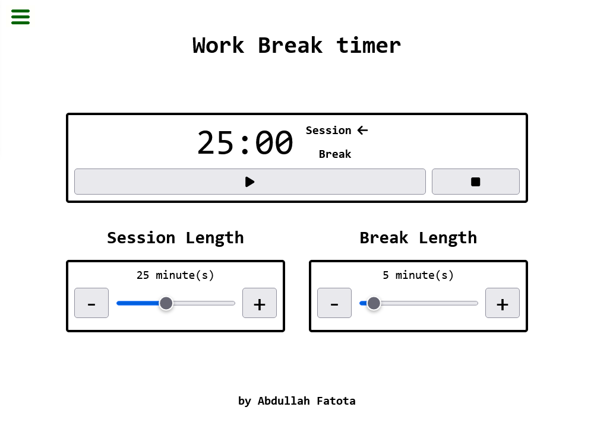

# Work Timer App

Timer App to set:

-   How many minutes to work, _for example 25 minutes_,
-   How many minutes to take a break, _for example 5 minutes_,

then let the app automatically **track time** and **play a sound** when one session ends and the other begins.

[Run the App!](https://new-af.github.io/)

